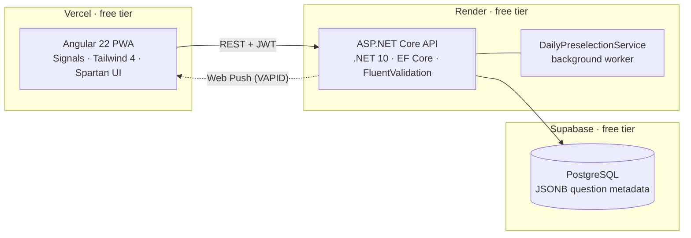

# Vaya Preguntita

> **Una pregunta al día sobre tu grupo de amigos.** Vote, discover who voted for whom, and let the friendly banter begin.


[](https://github.com/alexsepulvedaramos/Preguntitas/actions/workflows/deploy-backend.yml)

**🎮 Live demo:** [preguntitas-gamma.vercel.app](https://preguntitas-gamma.vercel.app)
*(runs on free-tier hosting — the very first request may take up to a minute while the API wakes up)*

---

## What is it?

**Vaya Preguntita** is a Spanish-language social game for groups of friends, built end-to-end as a full-stack project. Every day, each group answers **one question about its own members** — it activates at the group's configured time and stays open for exactly 24 hours. Everyone votes, and the results show **who voted for what**: the whole point is to spark debate and *pique sano* (friendly rivalry).

Each day one rotating member becomes the **selector** for the next day's question: they can pick from the group's own pool, browse 15 thematic packs, or create a question on the spot. If they do nothing, the system has already auto-selected one — **there is always a question**.

## Features

- 📅 **Daily lifecycle engine** — a background worker preselects tomorrow's question and activates today's at each group's configured time, per group, with rotating selector turns.
- 🗳️ **Six question types**, each with its own voting UI and results visualization (see below).
- 👀 **Transparent results** — live aggregates including exactly who voted for whom, revealed after you vote.
- 📦 **15 thematic question packs** (300+ curated questions in Spanish), toggleable per group, with clone-on-use templates and auto-resolution of member-dependent questions.
- 🔔 **Web Push notifications** (VAPID) — new question, your turn to pick, votes on your question; per-type preferences and per-group mute.
- 📱 **Installable PWA** — dark mode, pull-to-refresh, mobile-first layouts.
- 🕰️ **History archive** — browse any past day's question and results, cursor-paginated.
- 👑 **Group administration** — invite by code or link, kick members, transfer admin, configure the daily question time.
- 🔐 **JWT auth with rotating refresh tokens**, hashed at rest.

## Question types

| Type | What it asks | Results view |
|---|---|---|
| **Superlative** | "¿Quién del grupo es más probable que…?" — vote a member | Member ranking with voter avatars |
| **Deathmatch** | Team vs team showdown (2–4 teams, drag-and-drop builder) | Vote split per team |
| **Scale** | Rate a member — or anything — on a numeric range | Average headline + histogram |
| **Secret Pairing** | Match two members together | Combined pair ranking |
| **Custom Poll** | Classic poll, optional "Otro" free-text answer | Option ranking |
| **Open Text** | Open-ended question | Free-text response wall |

## Architecture



**Free-tier-only by design.** The entire production stack (Vercel + Render + Supabase) runs on free tiers with zero budget for upgrades. That constraint shapes the engineering: bounded row growth, per-user/per-group quotas and abuse limits, polling before SignalR, and an idempotent seeder that keeps startup cheap.

## Repository structure

```
/
├── client/                        # Angular 22 PWA (standalone components, Signals)
├── server/
│   ├── VayaPreguntita.API/        # ASP.NET Core (.NET 10) REST API
│   ├── VayaPreguntita.API.Tests/  # xUnit integration tests (Testcontainers)
│   └── Dockerfile                 # Render deployment image
├── docs/specs/vaya-preguntita.md  # Living spec — single source of truth
└── .github/workflows/             # CI: build + test + deploy on master
```

## Status & roadmap

The **MVP is feature-complete and live** (ramas 0–15 merged: daily lifecycle, all question types, voting, results, history, group admin, notifications, thematic packs). The next passes are specced and prioritized:

1. Mid-cycle daily-time change re-anchoring (rama 20)
2. Avatar dark-mode contrast + invite-link register flow (rama 17)
3. Fixed 1–10 Scale range (rama 16)
4. Public landing page + demo experience for solo visitors (rama 21)
5. Core-domain test coverage + full CI on PRs (rama 22)
6. **Play in English & German** — UI and all 300+ seeded questions, defaulting to the browser's language with a per-user override (ramas 23–24)
7. Per-group voting streaks with animated avatar frames (rama 19)
8. Unified mobile group header (rama 18)

**Phase 2 backlog** includes in-question chat/debate threads (the product's north star), Google OAuth, points & rankings, monthly stats, and email verification/password recovery. The full plan lives in the [spec §13/§16](docs/specs/vaya-preguntita.md).

## Engineering practices

- **Spec-driven development** — an 800-line [living spec](docs/specs/vaya-preguntita.md) is the single source of truth for behavior, data model, API contract, validation rules and the branch plan. Every feature branch updates it before the PR opens.
- **One branch per rama** (backend + its Angular UI), cut from `master`, Conventional Commits throughout.
- **English code, Spanish UI** — identifiers, comments and commits in English; all user-facing copy in Spanish.
- **Clean boundaries** — DTOs at the API edge (never EF entities), business logic in services only, FluentValidation for input, every schema change through an EF migration.
- **CI/CD** — GitHub Actions builds, tests and deploys the backend to Render on every push to `master`.

## Getting started

| I want to… | Go to |
|---|---|
| Run the API locally | [server/README.md](server/README.md) |
| Run the Angular client locally | [client/README.md](client/README.md) |
| Understand the product & data model | [docs/specs/vaya-preguntita.md](docs/specs/vaya-preguntita.md) |
